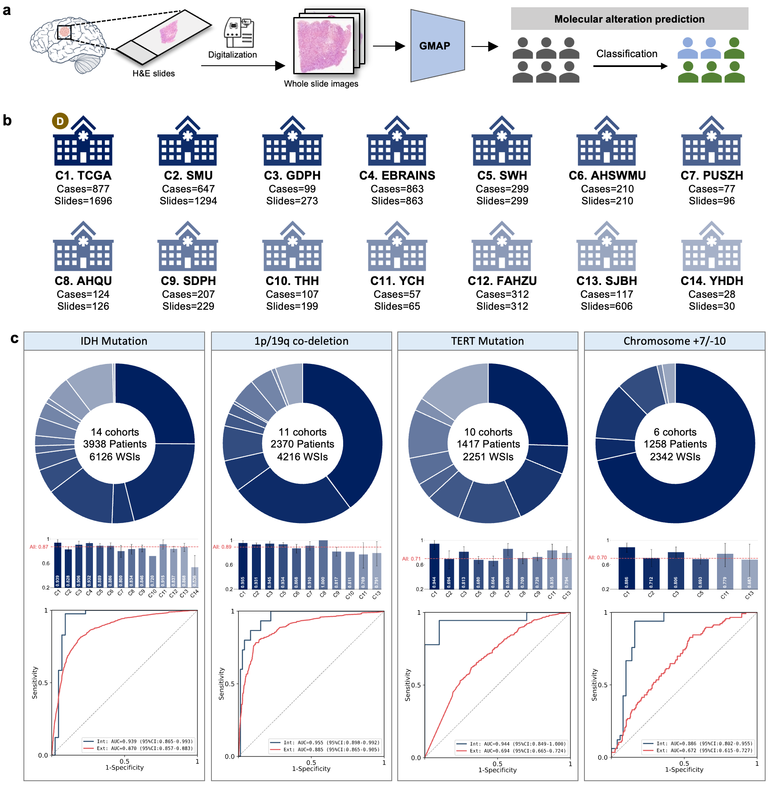

# Molecular alterations prediction in gliomas via an interpretable computational pathology model: a multicentre and retrospective study


## Summary
### Background 
Molecular profiling of gliomas plays a pivotal role in diagnosis, treatment selection, and prognostic assessment. However, it heavily relies on the time-consuming and expensive genomic testing, which largely inaccessible in resource-limited settings. To enable cost-effective and scalable identification of molecular alterations, we developed and validated a foundation model-empowered interpretable approach to predict four key molecular events directly from routine histopathology slides without manual annotation.

### Methods 
In this multicenter retrospective study, we collected the histopathology slides from patients underwent glioma resection at 12 Chinese hospitals and downloaded two publicly available datasets from The Cancer Genome Atlas (TCGA) and EBRAINS databases. The internal development cohort comprised 1,696 whole slide images (WSIs) from 877 patients downloaded from TCGA. The remaining 13 centers, consisting of 4,602 WSIs from 3,147 patients, were regarded as the external validation cohorts to evaluate the model generalizability. We developed **GMAP** (Glioma Molecular Alterations Predictor), a foundation model-powered computational pathology approach that predicts four key molecular alterations, including IDH mutation, 1p/19q co-deletion, TERT promoter mutation, and chromosome 7 gain/10 loss (+7/-10). The model's interpretability was comprehensively evaluated through cellular- and morphological-level analysis of high-contribution tiles, and comparative assessment between model-generated heatmaps and corresponding immunohistochemical staining patterns.

## Running projects
### Installation
- Linux (Ubuntu 22.04)
- NVIDIA GPU (Nvidia GeForce RTX 3090)

conda environment

```python
conda create -n GMAP python==3.10.15
conda activate GMAP
pip install -r requirements.txt
```

### Magnification
GMAP was trained and evaluated using whole slide images (WSIs) at a magnification of 20×. For consistency and optimal feature representation, it is advisable to maintain the input images at 20× magnification during the feature extraction stage.

`Note: Training and testing can still be performed using WSI at other magnifications, but results may differ from those reported in the paper.`

### Label
In the csv file `label/total_label.csv` that recorded label information, `1` represents: IDH mutation, 1p19q co-deletion, TERT mutation and +7/-10 positive，`0` represents the wild-type or negative, `na` means the label is not available.

### 1. Tissue segmentation and feature extraction
The WSI preprocessing and feature extraction step in this study follow the same protocol as described in the CLAM framework (https://github.com/mahmoodlab/CLAM). Feature extraction of slide can be performed using either `UNI` or other pathology foundation models. GMAP applied `UNI` as the tile-level features extractor.

### 2. Feature path configuration
Before training or testing, the path to the feature data must be modified. Specifically, variable `DATA_DIR` in `datasets/my_dataloader.py` must be changed to the feature path saved during the feature extraction step. Note that the path needs to be matched with the feature extraction model being used.

### 3. Data split
Before running the code, the dataset needs to be divided into training, validation and test sets. And save the patient ID in each set as a `CSV` file, named 'train.csv', 'val.csv' and 'test.csv' respectively, and place them in the `data_split` directory. The format of `CSV` is:

```python
#training.csv
patient1
patient2
...
```

### 4. WSI analysis architecture
GMAP applied our previously proposed Transformer-based architecture `GLTrans` (https://github.com/Bingchao-Zhao/MAG-GLTrans) for WSI analysis.

### 5. Training

```python
python train.py --stage='train'  
```

In the `train.py` script:
* `--stage`: 'train' or 'test'.
* `--gen_type`: The genotype to be predicted. 'TERT, IDH, 1p19q and 7g10l'
* `--extractor`: Foundation model of feature extraction.

### 6. Testing
```python
python train.py --stage='test' 
```

## Model weights
We provide the model weights reported in the paper for the molecular diagnoses of IDH, 1p19q, TERT, and +7/-10. These weights were trained on the TCGA-Glioma (combined TCGA-LGG and TCGA-GBM) dataset using UNI as the feature extractor. For inference, place the model in the corresponding directory (`logs/GMAP/UNI/TCGA/(gen)/GMAP`) and run the script in "test" mode. The model weights can be downloaded from Google Drive (https://drive.google.com/file/d/17X5aLFs8ZiZ9z-0Jwg-hEhg2pQAshpDo/view?usp=sharing).

## Citation


