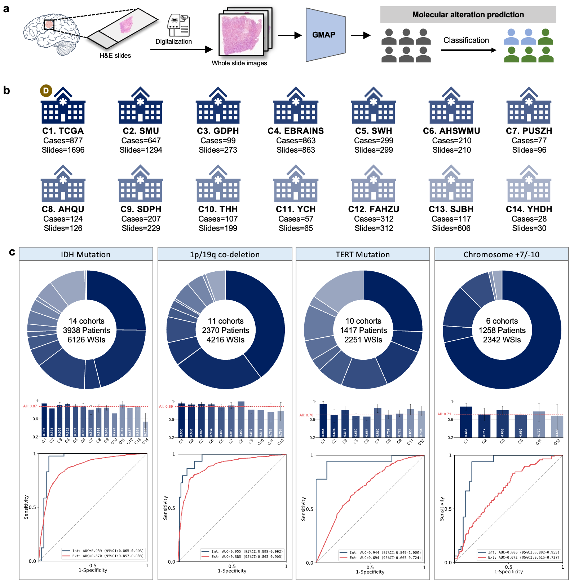

# Molecular alterations prediction in gliomas via an interpretable computational pathology model: a multicentre and retrospective study


### Summary
### Background 
Molecular profiling of gliomas plays a pivotal role in diagnosis, treatment selection, and prognostic assessment. However, it heavily relies on the time-consuming and expensive genomic testing, which largely inaccessible in resource-limited settings. To enable cost-effective and scalable identification of molecular alterations, we developed and validated a foundation model-empowered interpretable approach to predict four key molecular events directly from routine histopathology slides without manual annotation.

### Methods 
In this multicenter retrospective study, we collected the histopathology slides from patients underwent glioma resection at 12 Chinese hospitals and downloaded two publicly available datasets from The Cancer Genome Atlas (TCGA) and EBRAINS databases. The internal development cohort comprised 1,696 whole slide images (WSIs) from 877 patients downloaded from TCGA. The remaining 13 centers, consisting of 4,602 WSIs from 3,147 patients, were regarded as the external validation cohorts to evaluate the model generalizability. We developed **GMAP** (Glioma Molecular Alterations Predictor), a foundation model-powered computational pathology approach that predicts four key molecular alterations, including IDH mutation, 1p/19q co-deletion, TERT promoter mutation, and chromosome 7 gain/10 loss (7+/10-). The model's interpretability was comprehensively evaluated through cellular- and morphological-level analysis of high-contribution tiles, and comparative assessment between model-generated heatmaps and corresponding immunohistochemical staining patterns.

## Running Projects
### Installation
- Linux (Tested on Ubuntu 22.04)
- NVIDIA GPU (Tested on a single Nvidia GeForce RTX 3090)

conda environment

```python
conda create -n GMAP python==3.10.15
conda activate GMAP
pip install -r requirements.txt
```

### Magnification
GMAP was trained and evaluated using whole slide images (WSIs) at a magnification of 20×. For consistency and optimal feature representation, it is advisable to maintain the input images at 20× magnification during the feature extraction stage.

### Tissue Segmentation and Feature Extraction
The preprocessing and feature extraction steps in this study follow the same protocol as described in the CLAM framework. For implementation details, please refer to: https://github.com/mahmoodlab/CLAM.

### Feature Path Configuration
Prior to executing GMAP, it is necessary to configure the paths to both the feature and label files.
Before training or testing variable `DATA_DIR` in `datasets/camel_data.py` needs to be modified to the feature path obtained in the data preprocessing stage.
For the labels, b should be modified in a.

### Label
We place the labels of the TCGA datasets IDH, 1p19q,TERT and +7/-10 in `label/total_label.csv` as an example. In the table, `1` represents: 'IDH mutation, 1p19q co-deletion, TERT mutation and +7/-10 molecular event.


## Train

```python
python train.py --stage='train'  
```
## Test
```python
python train.py --stage='test' 
```
